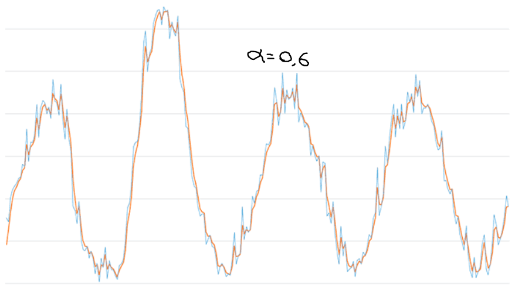
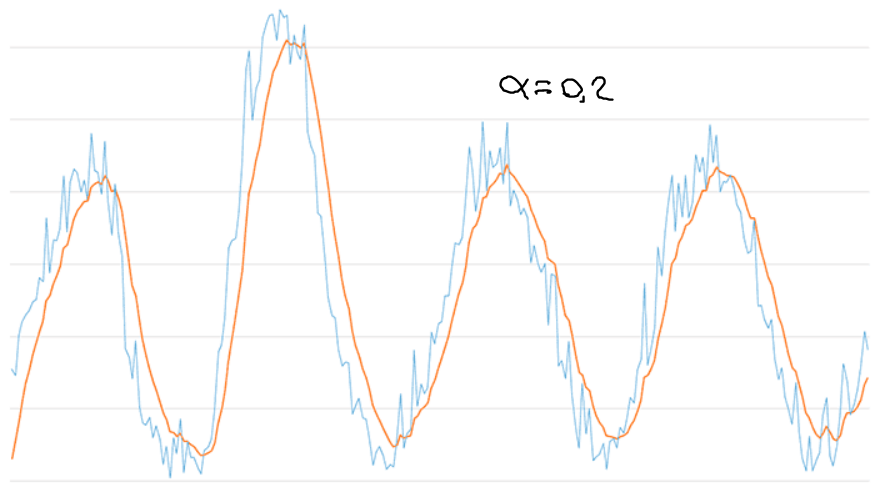

.. -*- coding: utf-8 -*-

.. _rcs_subversion:

Clase 04 - PIII 2024
====================
(Fecha: 13 de agosto)

Exponential Moving Average Filter (Media móvil exponencial)
===========================================================

- La ecuación en diferencia para este filtro es la siguiente:

.. figure:: images/formula_ema.png

- alpha está en el intervalo ``[0, 1]`` y es el factor de suavizado
- ``y[n]`` es la salida actual
- ``y[n - 1]`` es la salida anterior
- ``x[n]`` es la entrada actual

Ejemplos con distintos valores de factor de suavizado
-----------------------------------------------------

- Se llama exponencial porque el factor de ponderación aplicado a las entradas pasadas disminuye exponencialmente. Lo podemos visualizar sustituyendo las salidas anteriores.

.. figure:: images/sumatoria_ema.png

Ejercicio
=========

- Capturar con el micrófono algunos segundos.
- Definir una función que aplique este filtro de media móvil exponencial.
- Suavizar la señal con un factor de 0.6, 0.2 y 0.05 y visualizar el resultado.
- Realizar un análisis del espectro de frecuencias.
- Plotear la señal original y la filtrada superpuestas para notar el suavizado.

Simple Moving Average Filter (Media móvil simple)
==================================================

- La ecuación en diferencia para este filtro es la siguiente:

  y[n] = y[n-1] + (1 / W) * (x[n] - x[n-W])

- ``W`` es el tamaño de la ventana deslizante.
- ``y[n]`` es la salida actual.
- ``y[n-1]`` es la salida anterior.
- ``x[n]`` es la entrada actual.
- ``x[n-W]`` es la entrada que sale de la ventana.

- Este filtro actúa como un filtro pasabajos, suavizando la señal al promediar un número fijo de muestras y atenuar los cambios rápidos.

Ejercicio
=========

- implementar este filtro con distintos tamaños de ventana.
- Comparar con el Media móvil exponencial
- Realizar un análisis del espectro de frecuencias.
- Plotear la señal original y la filtrada superpuestas para notar el suavizado.
