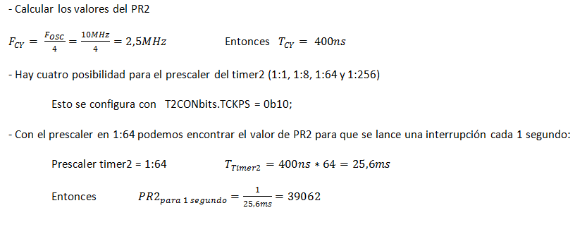

.. -*- coding: utf-8 -*-

.. _rcs_subversion:

Clase 12 - PIII 2024
====================
(Fecha: 23 de septiembre)

ADC controlando los momentos de muestreo con el Timer2	
======================================================

.. figure:: images/ejemplo_adc2.png

**Código fuente**

.. code-block::

	void config_adc()  {
	    ADPCFG = 0xFFFE; // Elije la entrada analógica a convertir en este caso AN0.
	    // Con cero se indica entrada analógica y con 1 sigue siendo entrada digital.

	    ADCON1bits.ADON = 0;  // ADC Apagado por ahora
	    ADCON1bits.ADSIDL = 1;  // No trabaja en modo idle
	    ADCON1bits.FORM = 0b00;  // Formato de salida entero
	    // Para tomar muestras en forma manual. Porque lo vamos a controlar con timer2
	    ADCON1bits.SSRC = 0b000;  
	    // Adquiere muestra cuando el SAMP se pone en 1. SAMP lo controlamos desde el Timer2.
	    ADCON1bits.ASAM = 0;  

	    ADCON2bits.VCFG = 0b000;  // Referencia con AVdd y AVss
	    ADCON2bits.SMPI = 0b0000;  // Lanza interrupción luego de tomar n muestras.
	    // Con SMPI=0b0 -> 1 muestra ; Con SMPI=0b1 -> 2 muestras ; Con SMPI=0b10 -> 3 muestras ; etc.

	    // AD1CON3 no se usa ya que tenemos deshabilitado el cálculo del muestreo con ADCS etc.

	    // Muestreo la entrada analógica AN0 contra el nivel de AVss (AN0 es S/H+ y AVss es S/H-)
	    ADCHS = 0b0000;  

	    ADCON1bits.ADON = 1;// Habilitamos el A/D
	}

	void detectarIntT2() org 0x0020  {
	    IFS0bits.T2IF=0;  // Borramos la bandera de interrupción T2

	    ADCON1bits.DONE = 0;  // Antes de pedir una muestra ponemos en cero
	    ADCON1bits.SAMP = 1;  // Pedimos una muestra

	    asm nop;

	    ADCON1bits.SAMP = 0;  // Pedimos que retenga la muestra
	}

	void interrupcionADC() org 0x002a  {

	    LATCbits.LATC14 = !LATCbits.LATC14;  // Para debug y ver si ingresa acá

	    // Almacenamos los 8 bits más significativos
	    LATBbits.LATB1 = ADCBUF0.B2;
	    LATBbits.LATB2 = ADCBUF0.B3;
	    LATBbits.LATB3 = ADCBUF0.B4;
	    LATBbits.LATB4 = ADCBUF0.B5;
	    LATBbits.LATB5 = ADCBUF0.B6;
	    LATEbits.LATE0 = ADCBUF0.B7;
	    LATEbits.LATE1 = ADCBUF0.B8;
	    LATEbits.LATE2 = ADCBUF0.B9;

	    IFS0bits.ADIF = 0; // Borramos el flag de interrupciones
	}

	int main()  {

	    // Elegimos el puerto B y E para la salida digital.
	    // Ya que no alcanzan los pines para que todo salga por un único puerto
	    TRISB = 0;
	    TRISE = 0;

	    TRISCbits.TRISC14 = 0;  // Para debug nomás

	    // Configuramos el módulo ADC
	    config_adc();

	    IEC0bits.ADIE = 1;  // Habilitamos interrupción del A/D

	    // Modo de operación Timer2 - Con el clock interno
	    T2CON = 0x0000;

	    // Prescaler para timer
	    // 00 -> 1:1 - 01 -> 1:8 - 10 -> 1:64 - 11 -> 1:256
	    T2CONbits.TCKPS = 0b01;

	    TMR2 = 0;
	    PR2 = 7;

	    IEC0bits.T2IE = 1;  // Habilita interrupciones timer2

	    // Arrancamos el timer2
	    T2CONbits.TON = 1;

	    while( 1 )  {  }

	    return 0;
	}

Ejercicio:
==========

- Esta semana completar el "Generador de tono variable con dsPIC y DAC R2R" (Clase 9)