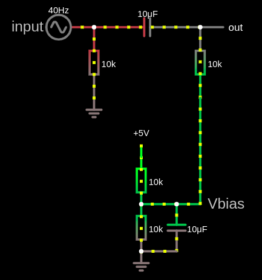

.. -*- coding: utf-8 -*-

.. _rcs_subversion:

Clase 14 - PIII 2024
====================
(Fecha: 14 de octubre)

**Agregar offset a la señal de audio para poder muestrear**

- Si deseamos muestrear la señal de audio desde nuestro celular o computadora, podemos conectar un conector estereo tipo plug de 3.5 mm y utilizar un canal para conectarlo al dsPIC.
- Para muestrarlo entre los valores VRef+ y VRef- debemos agregar un offset. Analizar el siguiente circuito:

- `Clic en este link para simular este circuito <http://www.falstad.com/circuit/circuitjs.html?cct=$+1+0.000005+51.8012824668342+50+5+50%0Ar+288+64+288+160+0+10000%0Ac+288+64+432+64+0+0.00001+-2.4789972859207126%0Ar+432+64+432+160+0+10000%0AR+288+64+240+64+0+1+40+2+0+0+0.5%0AO+432+64+480+64+0%0Ag+288+160+288+176+0%0Ar+352+240+352+304+0+10000%0Ar+352+304+352+368+0+10000%0AR+352+240+352+208+0+0+40+5+0+0+0.5%0Ag+352+368+352+384+0%0Ac+400+304+400+368+0+0.00001+2.5080583286223868%0Aw+352+304+400+304+0%0Aw+352+368+400+368+0%0Aw+400+304+432+304+0%0Aw+432+160+432+304+0%0Ax+442+310+492+313+4+20+Vbias%0Ax+176+70+219+73+4+20+input%0Ao+3+64+0+4098+2.187250724783012+0.00034175792574734563+0+2+3+3%0Ao+4+64+0+4098+8.749002899132048+4.8828125e-105+1+1%0A>`_

Transformada de Fourier
=======================

- Es un análisis en frecuencia de las señales
- La Transformada de Fourier nos indica de qué manera se distribuye, en función de la frecuencia, la potencia de la señal
- La Transformada de Fourier nos transforma una función (en el dominio del tiempo t) en otra función (en el dominio de la frecuencia f).
- La función en el dominio de la frecuencia tiene valores complejos.
- Se calcula el módulo para conocer las magnitudes (números reales) de cada componente en frecuencia (es lo que muestra un analizador de espectro).
- Cuando la función (en el dominio del tiempo t) es discreta, se utiliza la Transformada Discreta de Fourier (DFT: Discrete Fourier Transform).
- La Transformada Rápida de Fourier (FFT: Fast Fourier Transform) es un algoritmo eficiente para calcular la DFT. 

**Ejemplo:** Cálculo de FFT con funciones de la biblioteca de MikroC.

.. code-block:: c

	// dsPIC30F4013
	// Placa Easy dsPIC 
	// Entrada analogica AN7 - VRef es AVdd y AVss -
	// Detecta las frecuencias 100 Hz, 200 Hz, 300 Hz, ..., 6300 Hz
	// Publica el resultado en binario en los puertos RB0-RB5 (valores desde 1 al 63)

	const unsigned long CANT_MUESTRAS = 128;  // 128 pares de valores [Re, Im]
	const unsigned long FREC_MUESTREO  = 12800;  // Frecuencia de muestreo.

	unsigned Samples[ CANT_MUESTRAS * 2 ];  // Capacidad para 256. Porque son 128 pares

	// La funcion FFT requiere que las muestras se almacenen en el bloque de datos Y.
	// Este bloque de memoria es una caracteristica de los dsPIC que permite realizar
	// operaciones en una sola instruccion, lo que aumenta la velocidad de calculo.
	ydata unsigned InputSamples[ CANT_MUESTRAS * 2 ];

	unsigned freq = 0;

	// Es un indice para llevar la cuenta de cuantas muestras vamos guardando en Samples.
	unsigned globali = 0;

	// Bandera para saber si ya se encuentra listo el procesamiento FFT para mostrar el resultado.
	char listo = 0;

	void configuracionADC()  {
	    ADPCFG = 0b01111111;  // elegimos AN7 como entrada para muestras
	    ADCHS = 0b0111; // usamos AN7 para recibir las muestras en el ADC
	    ADCON1bits.SSRC = 0b111; //  Internal counter ends sampling and starts conversion (auto convert)
	    ADCON1bits.FORM = 0b11;  // Signed Fractional (DOUT = sddd dddd dd00 0000)
	    ADCON2bits.VCFG = 0b000;  // tension de referencia Avdd y Avss
	}

	// Function for converting 1.15 radix point to IEEE floating point variable (needed for sqrt).
	float Fract2Float( int input )  {
	    if ( input < 0 )
	        input = - input;
	    return ( input / 32768. );
	}

	// Analiza los componentes de la FFT para luego publicar el resultado en los puertos RB0-RB5
	// Las muestras "Samples" contiene la secuencia Re, Im, Re, Im...
	void obtenerResultado() {
	    unsigned Re, Im, k, max;
	    unsigned i = 0;  // Solo como indice para ir avanzando sobre InputSamples
	    float    ReFloat, ImFloat, amplitud;

	    // La k corresponde al componente, k=0 para la continua, k=1 para 100 Hz,
	    // k=2 para 200 Hz, etc. hasta k=63 para 6300 Hz
	    k = 0;
	    max = 0;  // Almacena el valor maximo de la amplitud de la muestra DFT
	    freq = 0;  // Reset current max. frequency for new reading

	    // 63 ciclos porque no podria muestrear mas de 63 * 100 Hz = 6300 Hz
	    // (que es la mitad de la frecuencia de muestreo)
	    while ( k < ( CANT_MUESTRAS / 2 ) )  {
	        Re = InputSamples[ i++ ];  // Parte Real de la muestra DFT
	        Im = InputSamples[ i++ ];  // Parte Imaginaria de la muestra DFT

	        ReFloat = Fract2Float( Re );  // Conversion a float
	        ImFloat = Fract2Float( Im );  // Conversion a float

	        // Amplitud de la actual muestra DFT
	        amplitud = sqrt( ReFloat * ReFloat + ImFloat * ImFloat );

	        // DFT esta en escala 1/amplitud, por eso lo volvemos a escala
	        amplitud  = amplitud * CANT_MUESTRAS;

	        if ( k == 0 )
	            amplitud = 0;  // Elimina la continua

	        if ( amplitud > max ) {
	            max = amplitud;  // Almacenamos el valor maximo hasta ahora
	            freq = k;  // Almacenamos el componente con mayor potencia
	        }

	        // Avanzamos de a un componente.
	        // En este caso, nos desplzamos 100 Hz cada vez que incrementamos k
	        k++;
	    }

	    // Con esta linea freq tomaria los valores en Hz de la frecuencia con mas potencia.
	    // freq *= (FREC_MUESTREO / CANT_MUESTRAS);

	    // Desplegamos el valor en los puertos RB0-RB5
	    LATBbits.LATB5 = ( freq & 0b0000000000100000 ) >> 5;
	    LATBbits.LATB4 = ( freq & 0b0000000000010000 ) >> 4;
	    LATBbits.LATB3 = ( freq & 0b0000000000001000 ) >> 3;
	    LATBbits.LATB2 = ( freq & 0b0000000000000100 ) >> 2;
	    LATBbits.LATB1 = ( freq & 0b0000000000000010 ) >> 1;
	    LATBbits.LATB0 = ( freq & 0b0000000000000001 ) >> 0;

	    LATBbits.LATB11 = !LATBbits.LATB11;  // Cada vez que se publica el resultado
	}

	unsigned leerAdc()  {
	    ADCON1bits.SAMP = 1;  // Pedimos una muestra
	    asm nop;  // Tiempo que debemos esperar para que tome una muestra
	    ADCON1bits.SAMP = 0;  // Pedimos que retenga la muestra

	    return ADCBUF0;  // Devolvemos el valor muestreado por el ADC
	}

	// Llena Samples con las muestras en Re y Im se pone en 0. Luego copia en el bloque de memoria Y
	void SampleInput()  {
	    Samples[ globali++ ] = leerAdc();   // Re
	    Samples[ globali++ ] = 0;           // Im

	    LATFbits.LATF1 = !LATFbits.LATF1;  // En este puerto se puede ver la frecuencia de muestreo

	    // Entra a este if cuando ya tiene 128 pares.
	    if ( globali >= ( CANT_MUESTRAS * 2 ) )  {
	        globali = 0;
	        if ( ! listo )  {  // Todavia no tenemos suficientes muestras

	            // Copiamos las muestras del ADC hacia el bloque de memoria Y
	            memcpy( InputSamples, Samples, CANT_MUESTRAS * 2 );

	            // Ya estamos listos para aplicar FFT.
	            // Esto habilita el uso de la funcion FFT en la funcion main()
	            listo = 1;
	        }
	    }
	}

	void  configuracionPuertos()  {
	    TRISFbits.TRISF1 = 0;  // Debug frec de muestreo
	    TRISBbits.TRISB11 = 0;  // Debug cada vez que se publica el resultado

	    // Lo siguientes puertos para mostrar la frecuencia con mayor potencia
	    TRISBbits.TRISB0 = 0;
	    TRISBbits.TRISB1 = 0;
	    TRISBbits.TRISB2 = 0;
	    TRISBbits.TRISB3 = 0;
	    TRISBbits.TRISB4 = 0;
	    TRISBbits.TRISB5 = 0;

	    TRISBbits.TRISB7 = 1;  // AN7 para entrada analogica

	}

	void detectarT2() org 0x0020  {
	    SampleInput();  // Se encarga de tomar las muestras
	    IFS0bits.T2IF = 0;  // Bandera Timer 2
	}

	void configuracionT2()  {
	    PR2 = ( unsigned long )( Get_Fosc_kHz() ) * 1000 / ( 4 * FREC_MUESTREO );
	    IEC0bits.T2IE = 1;  // Habilitamos interrucion del Timer 2
	}

	void main()  {

	    memset( InputSamples, 0, CANT_MUESTRAS * 2 );  // Ponemos en cero el buffer para las muestras

	    configuracionPuertos();

	    configuracionT2();
	    T2CONbits.TON = 1;  // Encendemos Timer 2

	    configuracionADC();
	    ADCON1bits.ADON = 1;  // Encendemos el ADC

	    while ( 1 )  {
	        if ( listo ) {
	            // Calcula FFT en 7 etapas, 128 pares de muestras almacenados en InputSamples.
	            FFT( 7, TwiddleCoeff_128, InputSamples );

	            // Método de inversión de bits, necesario para aplicar el algoritmo de FFT.
	            BitReverseComplex( 7, InputSamples );

	            // Analiza la amplitud de las muestras DFT y publica resultados en RB0-RB5
	            obtenerResultado();  

	            listo = 0;  // Indicamos que publicamos un resultado y esperamos el proximo analisis
	        }
	    }
	}

